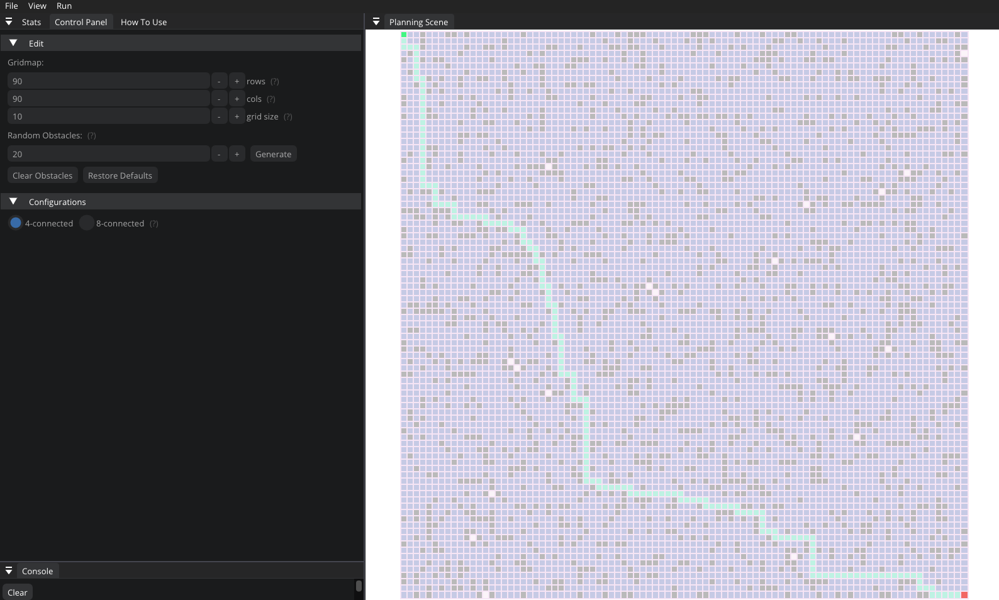

# Visualizer

## **Dependencies**

- **cmake >= 3.14**
  - All OSes: [click here for installation instructions](https://cmake.org/install/)
- **make >= 4.1 (Linux, Mac), 3.81 (Windows)**
  - Linux: make is installed by default on most Linux distros
    > **_LINUX NOTE:_** Just install the standard lib deps and then consider just how cooler you are than everyone else.
  - Mac: [install Xcode command line tools to get make](https://developer.apple.com/xcode/features/)
    > **_MAC NOTES:_** Install xcode and wait 3 years while it sets up.
  - Windows: [Click here for installation instructions](http://gnuwin32.sourceforge.net/packages/make.htm)
    > **_WINDOWS NOTES:_** If you enjoy being happy but are using Windows use gnuwin32, it's less of a headache, and you won't cry for an hour. Not that I did. Shut up; you're the one whos crying.
- **gcc/g++ >= 5.4**
  - Linux: gcc / g++ is installed by default on most Linux distros
  - Mac: same as make - [install Xcode command line tools](https://developer.apple.com/xcode/features/)
  - Windows: recommend using [MinGW](http://www.mingw.org/)

## **Setup**

#### Linux

You can either manually run these commands or sudo execute the install script in the root.

`sudo apt-get install libfreetype-dev libudev-dev libglfw3 libglfw3-dev libglfw3-doc`

#### Mac

For those who use Mac, you get to go through xcode hell and wait 20 years to install it. You can find it here at [apps.apple.com](https://apps.apple.com/us/app/xcode/id497799835?mt=12). If xcode doesn't install make run `brew install make` to install make.


In addition to Xcode, you will also need CMake, so head over to [cmake.org](https://cmake.org/download/) and install it. Luckily there is a pre-compiled binary you can install.

#### Windows

For windows there are pre-compiled binaries located at [cmake.org](https://cmake.org/download/) that you can install. You can also build it manually if you want.

For make just install gnuwin32, or alternatively be adventerous and use [chocolatey](https://chocolatey.org/install).

## **Build**

The building process is quite simple. Create a new directory in the root called build by running `mkdir build`.

Enter the build directory and run `cmake .. && make`. This will execute CMake, set up the build folder, and build the project.

Once the project is built, run `./main` and the program will pop up!



## **Code**

#### Node

BFS and DFS are automatically supported and should act as references for any other modules that you might add.

.CPP and .H are split between src and include to prevent clutter.

When working with the grid, instead of `vector<vector<int>>` you'll be using the node class. The node class contains the following properties:

<details>
  <summary>Click to view properties</summary>

```
// Constructor
Node();

// Destructor
~Node();

// Functions
const bool isObstacle() const;
const bool isVisited() const;
const bool isFrontier() const;
const bool isPath() const;
const bool isStart() const;
const bool isGoal() const;

// Accessors
sf::Vector2i getPos() const;
std::shared_ptr<Node> getParentNode();
const std::vector<std::shared_ptr<Node>>* getNeighbours() const;
const double getGDistance() const;
const double getFDistance() const;

// Mutators
void setObstacle(bool b);
void setVisited(bool b);
void setFrontier(bool b);
void setPath(bool b);
void setStart(bool b);
void setGoal(bool b);
void setPosition(sf::Vector2i pos);
void setNeighbours(std::shared_ptr<Node> node);
void clearNeighbours();
void setParentNode(std::shared_ptr<Node> node);
void setGDistance(double dist);
void setFDistance(double dist);

//protected
// Variables
bool isObstacle_;
bool isVisited_;
bool isFrontier_;
bool isPath_;
bool isStart_;
bool isGoal_;
sf::Vector2i pos_;
std::vector<std::shared_ptr<Node>> vecNeighbours_;
std::shared_ptr<Node> parent_;
double gDist_;
double fDist_;
```

</details>

One of the neat features of node is you can easily access it's neighbours. This is done by using the getNeighbours() function.

```
for (auto node_neighbour : *node_current->getNeighbours()) {
  ...
  node_neighbour->setVisited(true);
  node_neighbour->setObstacle(false);
  ...
}
```

#### Adding A Graph Based Algorithm

When adding an algorithm, you'll need to use graph_based and logger for the class to function. You can override certain functions in the class to change the behaviour of UI, but for the most part you only really need `initAlgorithm` and `updatePlanner` for this to work.

## **SFML**

This drove me nuts but if you want to, read up on [IMGUI-SFML](https://github.com/eliasdaler/imgui-sfml) and you can technically turn this into pacman by adding some custom assets.

## Notes

I forked this from another repo and added some features from a few other random repos I found while exploring. I also added a random obstacles function, better docs, performance fixes, fixed UI glitches between environments, and set up some build tools. Hope this is useful!
